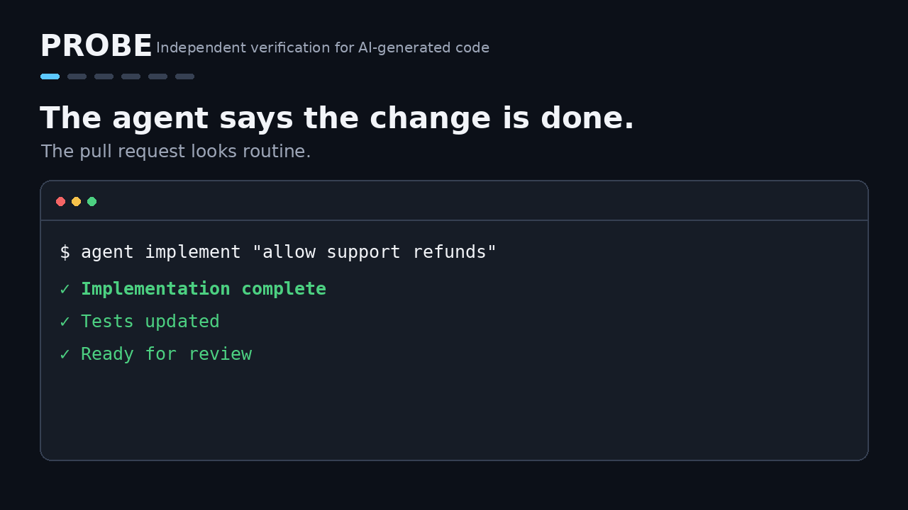

# Probe

[](https://probe.technology/download.html)
[](LICENSE)
[](app/docs/BADGE.md)

> **Independent verification for AI-generated code.**

**AI agents write code. Probe verifies the evidence before you merge it.**

Probe reviews Git changes with fixed, explainable rules, runs your checks in disposable containers, and produces a focused review surface with traceable evidence. AI is optional: a model may investigate, but a model's opinion is never treated as proof.

<p align="center">
  
</p>

<p align="center">
  <a href="https://probe.technology/">Website</a> ·
  <a href="https://probe.technology/download.html">Download</a> ·
  <a href="https://probe.technology/docs.html">Docs</a> ·
  <a href="https://app.probe.technology/">Probe Hub</a>
</p>

---

## Why Probe?

AI coding agents can generate changes faster than humans can review them.

The bottleneck is moving from **writing code** to **deciding what can be trusted**.

Traditional CI answers:

> Did the configured checks pass?

Probe adds a different question:

> **What changed, what is risky, what was actually verified, and where does a human still need to look?**

Probe is designed as an independent verification layer between coding agents and merge.

```text
Claude Code / Cursor / Codex / Copilot
                 │
                 ▼
          AI-generated change
                 │
                 ▼
               Probe
       ┌─────────┴─────────┐
       │                   │
       ▼                   ▼
  evidence +          scope / risk
    checks              signals
       │                   │
       └─────────┬─────────┘
                 ▼
        merge or human review
```

---

## The 2-minute try

Download the latest binary for Windows, macOS, or Linux from:

**https://probe.technology/download.html**

Then, inside any Git repository:

```bash
# Compare the last commit with its parent.
# No policy, Docker, or API key required.
probe lint HEAD~1..HEAD
```

To adopt Probe in a repository:

```bash
# Generate a review policy once.
probe init

git add .probe.json
git commit -m "Add Probe review policy"

# Run on each pull request.
probe review --base main --ci
```

`--ci` gives the pipeline a meaningful decision:

```text
exit 0  → the configured gate does not require human review
exit 2  → human review required; reasons are listed
```

A zero exit code is **not** a correctness claim. It means the trusted policy's low-risk gate was satisfied.

---

## What Probe catches

Probe maps the diff to review signals such as:

- authentication and authorization changes
- payment-sensitive code
- removed validation
- public API changes
- dependency changes
- sensitive paths
- missing nearby test changes
- unplanned files or exported APIs
- checks that failed or could not verify an area

The result is not another wall of AI comments.

It is a **smaller reading surface with reasons and evidence attached**.

---

## An example

An illustrative change can pass test, typecheck, build, and coverage while still removing a validation path.

Probe reports the checks as passed, then separately highlights the risky change.

```text
## Automated Checks
PASS test
PASS typecheck
PASS build
PASS coverage

## Suggested Human Review
HIGH  auth/auth.go
      Authentication or authorization function body changed

HIGH  payment/refund.go
      Payment-sensitive function body changed

HIGH  payment/refund.go
      Possible input validation removed
      No nearby test file changed

## Review Surface
19 / 125 changed lines
```

That is the point of Probe:

**green CI is evidence — not the entire answer.**

---

## Plan first, verify the scope later

For agent-written changes, Probe can evaluate intent **before the code exists**.

```bash
# 1. Ask the agent to simulate the work read-only
probe plan --intent-file task.md --ci

# 2. The agent implements the resulting plan

# 3. Check the final diff against that plan
probe review \
  --base origin/main \
  --plan .probe/PLAN.json \
  --ci
```

The plan acts as a contract for the intended change.

Probe can then flag:

- files touched outside the plan
- unannounced public API changes
- unexpected dependency changes
- critical paths the agent did not declare
- checks that did not pass

This makes autonomous changes more predictable:

```text
intent → plan → code → conformance → evidence → merge / review
```

---

## Evidence, not model confidence

Probe deliberately separates **signals**, **observations**, and **reproduced evidence**.

A model saying "this looks like a bug" is not proof.

When Probe attempts to reproduce an issue, the standard is stronger:

> a test that passes on the baseline and fails on the candidate

If that does not happen, the issue stays unverified.

Probe does **not** assign arbitrary confidence percentages.

---

## Sandboxed checks

Configured test, typecheck, build, and coverage commands can run in disposable containers with:

- no network
- non-root execution
- CPU, memory, PID, and time limits
- read-only inputs where appropriate
- no silent fallback to executing candidate code on the host

This is designed for reviewing untrusted or AI-generated changes without turning the review machine into the execution environment.

---

## Supported analysis

Probe currently provides risk analysis across:

- Go
- TypeScript / JavaScript
- Python
- Rust

Capabilities include:

- focused review surfaces
- impact analysis
- changed-line execution observations
- tests on baseline and candidate
- differential testing
- fuzzing / mutation workflows
- plan conformance
- SARIF / JSON / Markdown reports
- CI-oriented exit codes

---

## Claude Code plugin

Probe ships an official Claude Code plugin, so a developer or a coding agent can request reviews, read findings, manage the review context and fix issues from the session:

```text
/plugin marketplace add gvinsot/Probe
/plugin install probe@probe
```

Then `/probe:review` runs Probe on the committed changes, `/probe:findings T3` explains a finding with its evidence, `/probe:fix T3` works on it and checks the result with Probe, and `/probe:context intent` records the acceptance criteria the review is judged against. See [`plugins/probe/`](plugins/probe/README.md).

---

## CI

Probe is designed to run before merge.

A typical pipeline is:

```text
pull request
    │
    ├── normal CI
    │
    └── Probe
          │
          ├── risk signals
          ├── sandboxed checks
          ├── plan conformance
          └── evidence
                │
                ▼
         merge / human review
```

Probe can also publish machine-readable reports and PR-oriented findings.

See the [CI integration guide](app/docs/CI.md) for GitHub Actions and the reusable review workflow, and the [agent workflow](app/docs/AGENT_WORKFLOW.md) for checks before a pull request exists.

---

## Probe Hub

For teams, Probe Hub adds a web interface around the CLI.

It can:

- sign in with GitHub or GitLab
- bootstrap `.probe.json` policies
- monitor repositories
- display severity-filtered reports
- show changed lines behind each finding
- retain per-commit review artifacts

The Hub is packaged as a single container. Its state lives on a volume, or optionally in PostgreSQL, so it can be deployed next to GitHub Enterprise or a self-managed GitLab instance.

```bash
docker build -f hub/Dockerfile -t probe-hub .
docker run -p 8080:8080 \
  -e PROBE_HUB_BASE_URL=https://hub.example.com \
  -e PROBE_HUB_GITHUB_CLIENT_ID=... \
  -e PROBE_HUB_GITHUB_CLIENT_SECRET=... \
  -v hub-data:/var/lib/probe-hub \
  probe-hub
```

See [`hub/README.md`](hub/README.md) for configuration, PostgreSQL storage and the security model.

---

## Probe also reviews office documents

The repository also contains **Probe Desktop**, which applies the same review discipline to shared Word, Excel, and PowerPoint files.

It can flag changes such as:

- formulas replaced by values
- formulas whose ranges shrink
- changed amounts or percentages
- changed dates or obligations
- hidden sheets or slides
- macros and other risky modifications

Documents are compared locally; optional AI explanations receive only flagged excerpts and the passages that still use a replaced name or term.

See [`desktop/`](desktop/README.md) and [probe.technology](https://probe.technology/).

---

## Show it in your README

If Probe reviews your pull requests, add the badge:

[](https://probe.technology/)

```markdown
[](https://probe.technology/)
```

It says the project uses Probe, not that Probe approved the code. HTML, reStructuredText, shields.io styles and the live Probe Hub badge are in [`app/docs/BADGE.md`](app/docs/BADGE.md).

---

## What Probe does *not* claim

Review tooling earns trust by being precise about its limits.

Probe does not claim that:

- a green report proves the code is correct
- every signal is a confirmed bug
- executed code is automatically well tested
- a model's opinion is evidence
- a small review surface means the rest of the change is harmless
- plan conformance proves implementation correctness

Probe's job is narrower:

> **reduce the amount humans must inspect, while making the remaining reasons explicit and traceable.**

---

## Build from source

The CLI requires Go 1.23 or newer.

```bash
git clone https://github.com/gvinsot/Probe.git
cd Probe/app
go build -o probe ./cmd/probe
```

The repository uses a Go workspace, so tests can also be run from the root.

```bash
go test ./app/...
go test ./hub/...
```

Probe Desktop is a separate module outside the workspace: run `GOWORK=off go test ./...` from `desktop/`. Probe reviews its own pull requests with the root [`.probe.json`](.probe.json).

---

## Repository layout

| Directory | Purpose |
|---|---|
| [`app/`](app/README.md) | Probe CLI, its documentation and report schema |
| [`hub/`](hub/README.md) | GitHub / GitLab web hub |
| [`desktop/`](desktop/README.md) | Desktop document review app |
| [`web/`](web/) | probe.technology website |
| [`plugins/probe/`](plugins/probe/README.md) | Official Claude Code plugin |
| [`specs/`](specs/README.md) | Product and implementation specifications |
| [`devops/`](devops/) | PulsarCD / Docker Swarm deployment |

---

## Contributing

Probe is open source.

Useful contributions include:

- new language-aware risk signals
- adversarial examples
- CI integrations
- reproducible agent failure cases
- documentation improvements
- bug reports from real repositories

If Probe catches something interesting in an AI-generated change, open an issue with the smallest reproducible example you can share.

---

## The idea in one sentence

> **Your coding agent says it works. Probe asks for evidence.**

---

## License

Probe is licensed under **GNU AGPL-3.0** with an attribution term (section 7(b)) described in [`LICENSE`](LICENSE) and [`NOTICE`](NOTICE).

Releases through v0.3.0 remain available under the MIT license.
